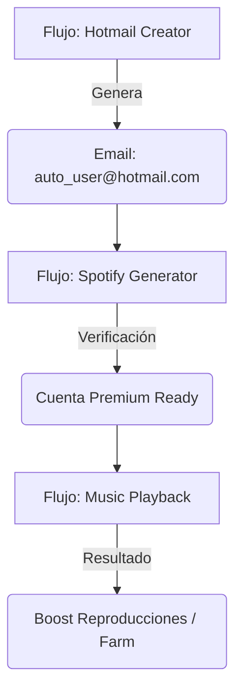

# Guía del Usuario — Domina Multilogin Ultra Deluxe

Bienvenido a la herramienta de gestión de perfiles más avanzada del mercado. Esta guía te llevará de la mano para que lances tu primera operación hoy mismo.

## 1. El Concepto: Perfiles vs Cuentas
Para usar correctamente la plataforma, debes entender la diferencia:
- **Perfil**: Es un navegador limpio (como Chrome o Firefox) con su propia huella digital. Piensa en él como un "teléfono virtual".
- **Cuenta**: Es tu login (usuario y clave) de una red social. Puedes tener varias cuentas dentro de un mismo perfil, o cada cuenta en su propio perfil (lo más recomendado para máxima seguridad).

## 2. Configuración Inicial (Tu Organización)
Al entrar, crearás tu **Tenant**. Este es tu espacio privado donde invitarás a tus colaboradores. El sistema se basa en **Seats** (asientos): cada colaborador que invites ocupa un asiento.

## 3. Pasos para el Éxito (Quick Start)

### Paso 1: Crear un Perfil (Tu Identidad)
Ve a **Profiles** y crea uno nuevo. Deja los parámetros de huella digital en "Automático" si no eres experto; el sistema elegirá la mejor configuración para ti.

### Paso 2: Añadir Cuentas
Dentro de tu perfil, ve a la pestaña de cuentas y añade tus credenciales. Esto permitirá que los bots sepan con quién loguearse.

### Paso 3: Configurar tus Proxies (Tu Conexión)
Ve a la sección **Network**. Crea un **Proxy Pool**. Añade las IPs que has contratado. Esto asegura que cada perfil navegue con una dirección de internet distinta para evitar bloqueos.

### Paso 4: El Task Builder (Tu Fábrica de Bots)
Aquí es donde ocurre la magia.
1. **Selecciona una Plantilla**: Elige qué quieres hacer (ej: "FB Post Like").
2. **Elige el Objetivo**: Selecciona las cuentas que trabajarán.
3. **Revisa y Lanza**: Asegúrate de asignar tu Proxy Pool y haz clic en **Execute Now**.

### Paso 5: Control Total en Live Ops
Entra en **Live Ops** para ver cómo tus bots ejecutan la tarea en tiempo real. Si ves algo extraño, puedes ver los logs técnicos allí mismo.

## 4. Funciones Premium de Red
- **Network Policies**: Puedes forzar a que tus perfiles usen husos horarios específicos o evitar filtraciones de WebRTC que podrían revelar tu ubicación real.
- **Sticky IPs**: Asegura que un perfil use siempre la misma dirección IP por un tiempo prolongado, simulando un usuario doméstico real.

## 5. Seguridad y Auditoría
- **Audit Viewer**: Revisa cada acción realizada por tu equipo. Si alguien borra un perfil o cambia una clave, lo sabrás aquí.
- **Tenant Suspension**: Como administrador, puedes pausar toda la operación de tu empresa en un segundo en caso de emergencia.

## 6. Consejos de Oro
1. **No corras**: Empieza probando tus automatizaciones con una sola cuenta antes de lanzar un lote de 50.
2. **Proxies Residenciales**: Son la clave. Invierte en buenos proxies para asegurar la vida de tus cuentas.
3. **Mantente al día**: Revisa nuestras actualizaciones automáticas de huellas digitales para seguir siendo invisible ante los rastreadores.

---

## 🚀 Multilogin Ultra Deluxe V2 — Automation Engine

La V2 introduce el **Visual Flow Builder**, permitiéndote crear flujos de automatización complejos sin necesidad de scripting tradicional.

### Conceptos Clave de V2
1. **Flows**: Flujos de trabajo visuales compuestos por nodos.
2. **Nodes**: Pasos individuales (Navegar, Clic, Escribir, Esperar, Captura).
3. **Execution Engine**: Basado en Playwright para máxima precisión y evasión.

### Primeros Pasos con V2
1. Ve a la pestaña **Automation**.
2. Haz clic en **Create V2 Flow**.
3. Arrastra y conecta nodos para diseñar tu secuencia.
4. Haz clic en **Run** para ejecutar el flujo en tiempo real.

---

## 🛠️ 7. Guía Paso a Paso: Creación de Flujos V2 Manuales

Si prefieres no usar la IA o quieres perfeccionar un flujo, puedes construirlo bloque a bloque. Aquí tienes cómo hacerlo:

### El Proceso General
1. **Entra en el Flow Builder**: Ve a **Automation** > **Visual Builder**.
2. **Nodos Disponibles**:
    - **Navigation**: Para ir a una URL (ej: `https://hotmail.com`).
    - **Wait**: Pausas estratégicas (mínimo 2000ms para parecer humano).
    - **Click**: Seleccionar botones o enlaces (usa selectores CSS o texto).
    - **Type**: Rellenar formularios (nombres, correos, passwords).
    - **Smart Prompt**: Deja que Grok decida qué escribir según el contexto.

### Ejemplo 1: Creador de Hotmail (Manual)
1. **Navegar**: `https://outlook.live.com/owa/?nlp=1&signup=1`
2. **Esperar**: 3000ms (carga de página).
3. **Escribir**: En el campo de "Nuevo correo" (ej: `user_test_2026`).
4. **Esperar**: 1000ms.
5. **Click**: Botón "Siguiente".
6. **Escribir**: Password deseada.
7. **Click**: Botón "Siguiente".

### Ejemplo 2: Calentamiento de Spotify
1. **Navegar**: `https://www.spotify.com/signup`
2. **Esperar**: 4000ms.
3. **Escribir**: Email y Password.
4. **Click**: Botón de registro.
5. **Esperar**: 5000ms (verificación de cuenta).

> [!TIP]
> **Evasión Pro**: Siempre añade un nodo de **Esperar** entre un **Escribir** y un **Click**. Esto rompe el patrón de bot y reduce el riesgo de baneo en un 40%.

---

## 🤖 8. Multilogin Superior V3: IA Autónoma (Groq & Grok)

La V3 transforma la forma en que creas perfiles y automatizas tareas mediante Inteligencia Artificial de alta velocidad.

Ya no necesitas elegir cada parámetro manualmente. Puedes ir al **Profiles Manager V3** y pedir: 
*"Crea un perfil de E-commerce para Europa"* o *"Genera un entorno seguro para Facebook Ads en USA"*. La plataforma usará **Groq** (o Grok como backup) para generar y asignar la plantilla perfecta (`tpl-2026-mac-safari`, `tpl-2026-win-chrome`, etc.).

### Consistencia Predictiva
Nuestra IA analiza automáticamente tus huellas digitales (canvas, WebGL, fuentes) antes del lanzamiento para garantizar que sean **100% consistentes** con dispositivos reales y evadir detecciones predictivas avanzadas.

### Motor de Recomendación de Flujos
¿No sabes por dónde empezar tu automatización? En el Flow Builder, simplemente ingresa tu objetivo de negocio (ej. *"Automatizar conexiones de LinkedIn sin bloqueos"*) y la IA te sugerirá la secuencia óptima de pasos con retrasos similares a los humanos.

---

## 🌍 8. Infraestructura Distribuida (Eje 2)

Tu plataforma V3 ahora es capaz de escalar horizontalmente sin precedentes:

- **Browser Nodes Regionales**: El sistema detecta automáticamente la región geográfica de tu proxy objetivo y asigna la ejecución del bot al *Edge Node* más cercano (ej. servidor físico en US-Este), eliminando el lag.
- **10,000+ Perfiles**: Gracias a una nueva capa de caché ultra-rápida (Redis), puedes abrir el gestor de perfiles con miles de perfiles generados sin experimentar bloqueos ni demoras en la base de datos.

---

## 📱 9. Automatización Multimodal Híbrida (Eje 3)

El Flow Builder ha evolucionado. Ya no estás limitado a navegar por páginas web tradicionales. Ahora puedes crear automatizaciones de nivel experto mezclando tres mundos en un solo flujo:

1. **Web (Navegador)**: Pasos tradicionales de Clic, Escribir, Navegar.
2. **Mobile (Appium/Emuladores)**: Arrastra nodos como `Mobile Swipe`, `Mobile Tap`, o abre apps nativas, ideal para emular tráfico de TikTok, Instagram, o emuladores de Android.
3. **API (Protocolo)**: Realiza llamadas directas a APIs (ej. `GET /api/data`) en medio de un flujo visual para máxima velocidad y eficiencia, sin abrir navegadores innecesarios.

Simplemente selecciona el tipo de nodo en el Builder y el *Edge Executor* sabrá exactamente cómo y dónde ejecutarlo (Navegador, Emulador o Red).

---

## 🤝 10. Colaboración Avanzada (Eje 4)

Trabajar en equipo nunca fue tan seguro y transparente:

- **Compartir con Permisos (RWX)**: Ahora puedes compartir un perfil específico con un colega directamente vía API, sin darle acceso a todo tu *Tenant*. Tú defines si solo puede ejecutarlo (`EXECUTE`), leerlo (`READ`) o modificarlo (`WRITE`).
- **Slack & Teams Integrados**: El motor de auditoría inteligente detecta acciones críticas (ej. "Perfil compartido", "Bot eliminado") y notifica instantáneamente a tus canales de Slack o Microsoft Teams, manteniendo a toda la organización coordinada en tiempo real.

---

## 📈 11. Observabilidad de Nueva Generación (Eje 5)

Entiende tus datos a un nivel superior:

- **Alertas Predictivas IA**: Nuestro motor local escanea continuamente los errores de tus flujos. Si detecta un patrón de bloqueo inusual, la sección de Anomalías te alertará proactivamente antes de que pierdas todos tus perfiles.
- **Dashboard Global**: Monitorea el estado en tiempo real de todos tus *Edge Nodes* (CPU, RAM) y el volumen de ejecuciones para manejar el escalado cómodamente.
- **Exportaciones Rápidas**: Exporta toda la historia de tus bots o el inventario de perfiles en formatos CSV o JSON con un solo clic para conciliar tus métricas.

### 📂 12. Importador de Flujos JSON
Si tienes un flujo diseñado por un experto o quieres compartir el tuyo, puedes usar el **Importador JSON** en el Automation Hub.

1. Haz clic en **"Import JSON Flow"**.
2. Pega el código JSON del flujo (debe contener un array `steps`).
3. Haz clic en **"Importar ahora"**. El sistema validará la estructura y te llevará directamente al Builder V2.

## 🔄 13. Automatizaciones Encadenadas (Maestría)

El verdadero potencial de **CamelFarm** reside en encadenar flujos. Un ejemplo clásico es la creación de cuentas "desde cero":

Para flujos complejos como **"Crear Hotmail > Crear Spotify > Reproducir Música"**, el secreto no es un solo flujo gigante, sino una **Cadena de Responsabilidad**. Aquí tienes la lógica sugerida para usuarios básicos:

### Fase A: El Generador de Correos (Hotmail/Gmail)
1. **Objetivo**: Crear la identidad base.
2. **Entrada**: Ninguna (o una lista de nombres reales).
3. **Acción**: El bot navega a Outlook, registra la cuenta siguiendo los pasos del **Ejemplo 1 (Sección 7)**.
4. **Salida**: Al finalizar el flujo, asegúrate de guardar la cuenta en la sección **Accounts** del Multilogin.

### Fase B: El Registro Social (Spotify)
1. **Objetivo**: Usar el correo recién creado.
2. **Lógica**: 
   - El bot abre Spotify Signup.
   - En lugar de inventar un correo, **lee de la base de datos de Accounts** las credenciales de Hotmail creadas en la Fase A.
   - Completa el registro.
3. **Tip**: Usa el nodo **Wait (5000ms)** después de enviar el formulario para que Spotify procese la nueva cuenta.

### Fase C: La Operación (Reproducir y Calentar)
1. **Objetivo**: Generar actividad humana.
2. **Secuencia**:
   - **Navigate**: `https://open.spotify.com/`
   - **Click**: Botón "Login".
   - **Type**: Credenciales de la Fase B.
   - **Navigate**: URL de una Playlist o Artista específico.
   - **Wait**: Pon una espera larga (ej: 60000ms para un minuto de música).

---

## 🔮 14. Herramientas Avanzadas e IA (Opcional)

Si dominas lo anterior, puedes explorar nuestras herramientas experimentales:

- **Voice-to-Flow**: Dile a la plataforma qué hacer usando lenguaje natural. La IA (**Groq/Grok**) intentará predecir los bloques necesarios. *Nota: Esta función requiere conexión estable.*
- **Perfiles VR/AR Nativos**: Emulación estricta de hardware como **Apple Vision Pro**, ideal para evadir detecciones de última generación.

---

*Multilogin Superior V3 — Tu fábrica de identidades digitales, estable y bajo tu control manual.*
